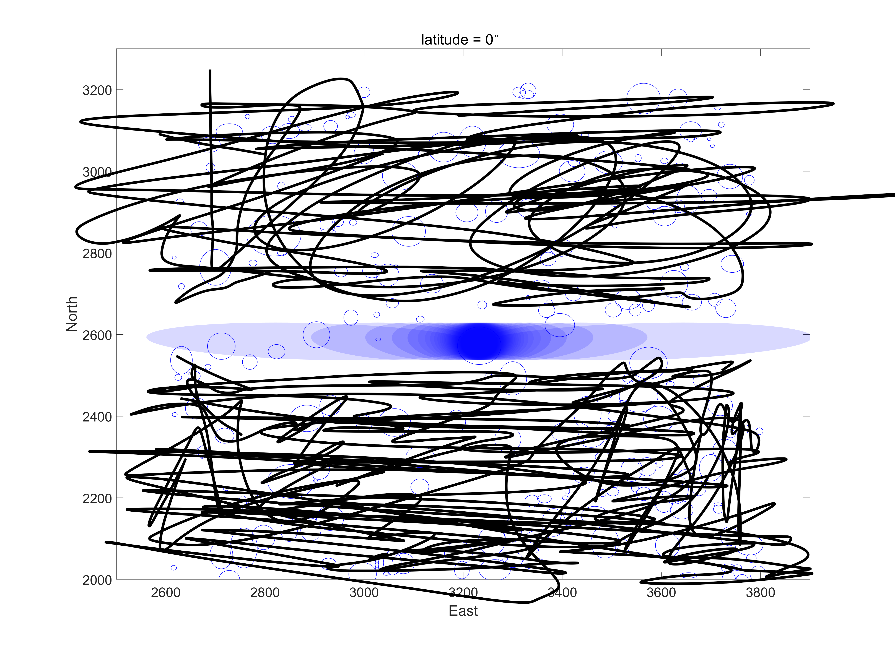
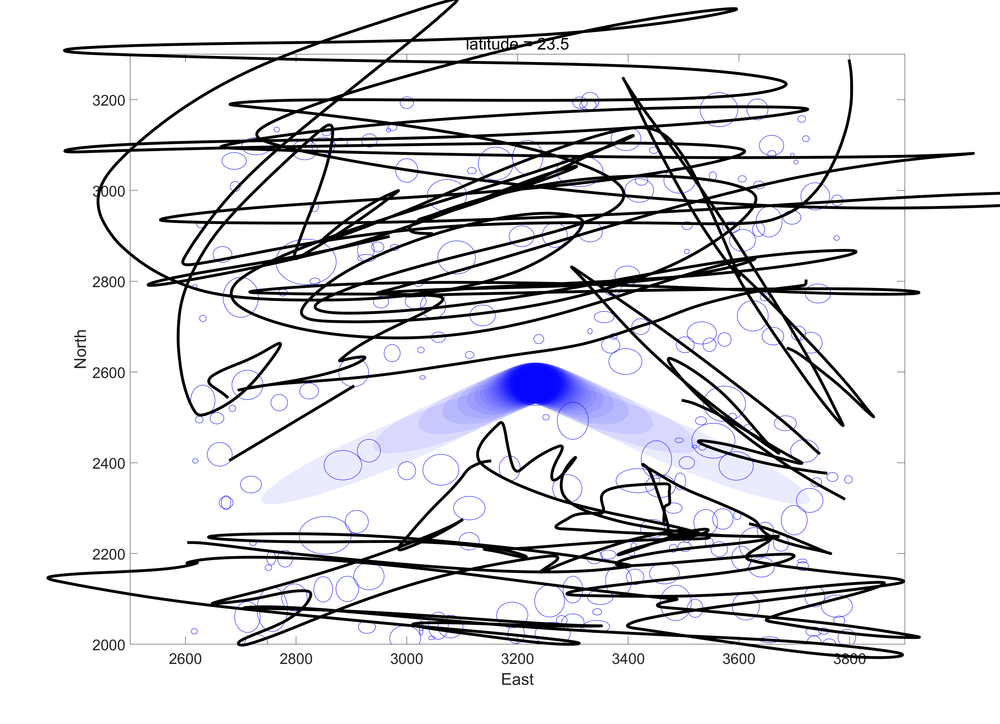

## Introduction
Calculate the shadow of a elipse, changing with location and  the time.

## Functions
-  `get_angle.m`
get the sun angle
- `get_loca.m`
- `plot_a_shadow.m`
plot a shadow
- `get_all_shadow.m`
plot multi-shadow with time changing

## Results

